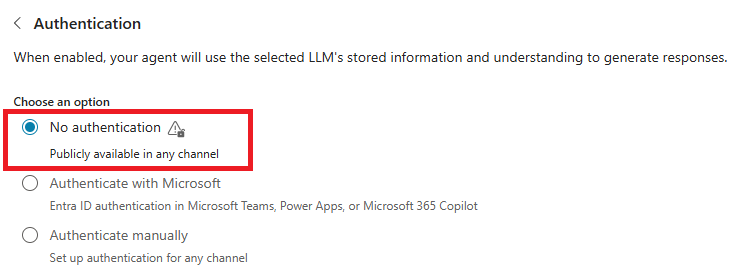
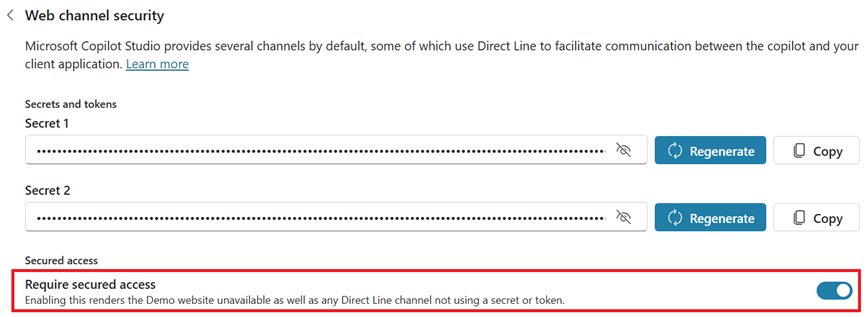
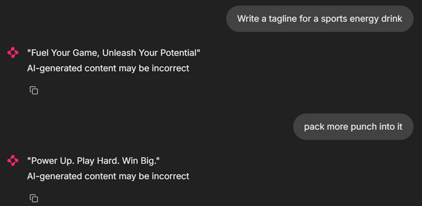
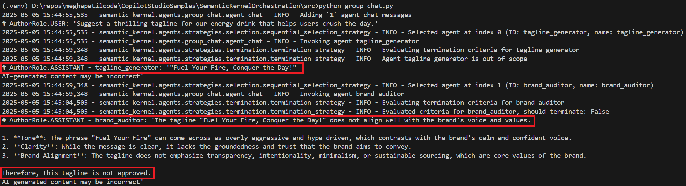
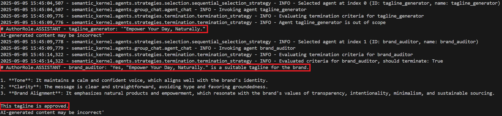

# Copilot Studio Agents interaction

This is a simple example of how to interact with Copilot Studio Agents as they were first-party agents in Semantic Kernel using the DirectLine API.

## Rationale

Semantic Kernel already features many different types of agents, including `ChatCompletionAgent`, `AzureAIAgent`, `OpenAIAssistantAgent` or `AutoGenConversableAgent`. All of them though involve code-based agents.

Instead, [Microsoft Copilot Studio](https://learn.microsoft.com/en-us/microsoft-copilot-studio/fundamentals-what-is-copilot-studio) allows you to create declarative, low-code, and easy-to-maintain agents and publish them over multiple channels.

This way, you can create any amount of agents in Copilot Studio and interact with them along with code-based agents in Semantic Kernel, thus being able to use the best of both worlds.

## Implementation

The implementation enables seamless integration with Copilot Studio agents via the DirectLine API. Several key components work together to provide this functionality:

- [`DirectLineClient`](src/agents/copilot_studio/directline_client.py): A utility module that handles all Direct Line API operations including authentication, conversation management, posting user activities, and retrieving bot responses using watermark-based polling.

- [`CopilotAgent`](src/agents/copilot_studio/copilot_agent.py): Implements `CopilotAgent`, which orchestrates interactions with a Copilot Studio bot. It serializes user messages, handles asynchronous polling for responses, and converts bot activities into structured message content.

- [`CopilotAgentThread`](src/agents/copilot_studio/copilot_agent_thread.py): Provides a specialized thread implementation for Copilot Studio conversations, managing Direct Line-specific context such as conversation ID and watermark.

- [`CopilotAgentChannel`](src/agents/copilot_studio/copilot_agent_channel.py): Adds `CopilotStudioAgentChannel`, allowing Copilot Studio agents to participate in multi-agent group chats via the channel-based invocation system.

- [`CopilotMessageContent`](src/agents/copilot_studio/copilot_message_content.py): Introduces `CopilotMessageContent`, an extension of `ChatMessageContent` that can represent rich message types from Copilot Studio—including plain text, adaptive cards, and suggested actions.

## Usage

For this sample, we have created two agents in Copilot Studio:
- The **TaglineGenerator agent** creates taglines for products based on descriptions
- The **BrandAuditor agent** evaluates and approves or rejects taglines based on brand guidelines

The TaglineGenerator is used in the single agent chat example, allowing you to interact with it directly. In the group chat example, both the TaglineGenerator and the BrandAuditor agents collaborate to create and refine taglines that meet brand requirements.

### Setting Up Copilot Studio Agents
Follow these steps to set up the Copilot Studio agents:

1. Download the `CopilotAgentsSemanticKernelDemo_1_0_0_1.zip` file. This is a Power Platform solution that contains the two agents described in previous section.
2. Follow the steps in the "How to Import an Agent Developed in Copilot Studio" section of [this documentation](https://techcommunity.microsoft.com/blog/modernworkappconsult/how-to-export-an-agent-developed-in-copilot-studio/4391562) to import the agents into your Power Platform environment. After importing, you will see the TaglineGenerator and BrandAuditor agents in the list of Copilot Studio agents in your environment.
3. Configure each agent for DirectLine communication:
    -   Turn off default authentication under the agent Settings > Security > Authentication.
      
    -    [Enable web channel security](https://learn.microsoft.com/en-us/microsoft-copilot-studio/configure-web-security) under agent Settings > Security > Web channel security > Require secured access. This enables secured access to copilot agents using DirectLine secrets or tokens. Copy the secret for the agent and save it for later use.
    
    -    [Publish the agents](https://learn.microsoft.com/en-us/microsoft-copilot-studio/publication-fundamentals-publish-channels?tabs=web#publish-the-latest-content) to start using them.

### Setting Up Environment

1. Create a `.env` file using the `.env.sample` file and add the agent secrets copied earlier to your `.env` file:
```
AUDITOR_AGENT_SECRET=<Brand Auditor agent secret>
TAGLINE_AGENT_SECRET=<Tagline Generator agent secret>
```
2. Set up your Python environment:

```bash
cd SemanticKernelOrchestration/src
python -m venv .venv

# On Mac/Linux
source .venv/bin/activate
# On Windows
.venv\Scripts\activate

pip install -r requirements.txt
```

### Running Single Agent Chat in Semantic Kernel

```bash
chainlit run --port 8081 .\chat.py
```

The chat.py file demonstrates a web-based chat interface that allows for multi-turn conversations with a single copilot agent.



### Running Agent Group Chat in Semantic Kernel

```bash
python group_chat.py
```

The agents will collaborate automatically, with the TaglineGenerator creating taglines and the BrandAuditor providing feedback until a satisfactory tagline is approved.




